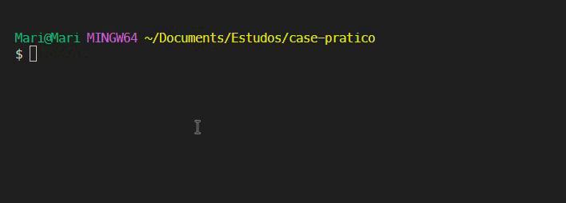

# Case Prático

Este estudo de caso foi desenvolvido com Python3. Utilizando o ambiente virtual Anaconda e as bibliotecas SQLite e Pandas.

### Pré-requisitos

Você precisará do `python3` e do `anaconda` instalados na sua máquina.
- [Python3 - Download](https://www.python.org/downloads/)
- [Anaconda - Download](https://www.anaconda.com/download) 

### Instruções

1. Clone este repositório 
```
git clone https://github.com/mxriannar/case-pratico.git
```


2. Abra a pasta do projeto no seu editor favorito
```
Exemplos: VSCode, PyCharm, etc.
```

3. Crie um ambiente virtual através do terminal integrado utilizando o Conda
```
conda create myenv
```

4. Ative o ambiente virtual através do terminal:
```
conda activate myenv
```

5. Instale as bibliotecas necessárias através do terminal:
```
pip install sqlite3 pandas
```

6. Se necessário, instale a biblioteca `openpyxl` através do terminal:
```
pip install openpyxl
```

### Executando o Script:

Execute o script Python através do terminal:
```
python index.py
```

### Exemplo de uso

